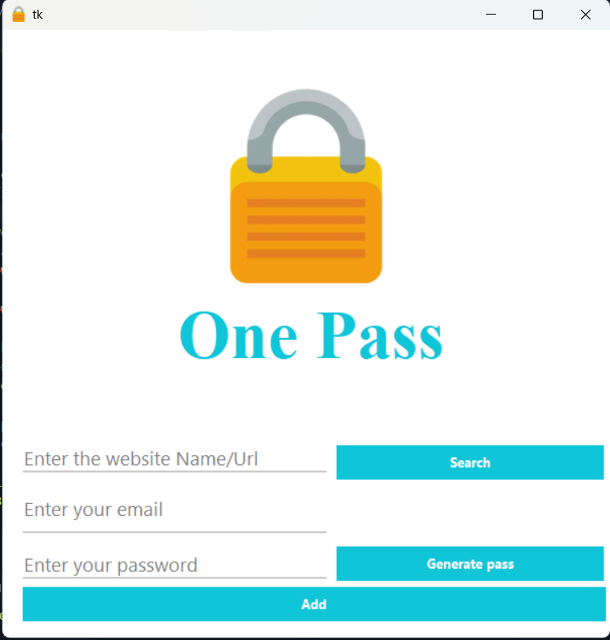

<div style="display:flex;height:300px ; width : 300px;align-items:center;background-color:black;border-radius:50%;
justify-content:center;
">
 
</div> 


# Password Manager App

A simple and secure **Password Manager** built using **Python**, **Tkinter**, and **JSON** as the database. This app helps you generate, store, and retrieve passwords for your accounts safely.

---

## Features

- **Generate Strong Passwords**: Create random, secure passwords with a click of a button.
- **Store Passwords**: Save account credentials (Website, Username, Password) in a local JSON file.
- **Search Credentials**: Quickly retrieve saved passwords for a specific website.
- **User-Friendly GUI**: Built with **Tkinter** for an easy-to-use interface.
- **Data Persistence**: All data is stored securely in a JSON file.

---

## Screenshots

 


---

## Installation

1. Clone this repository:

```bash
git clone https://github.com/rakshitbagait/My-key.git
````

2. Navigate to the project folder:

```bash
cd password-manager
```

3. Install required libraries (if not already installed):

```bash
pip install tk
pip install pyperclip
```

> **Note:** `pyperclip` is used to copy passwords to the clipboard.

---

## Usage

1. Run the app:

```bash
python password_manager.py
```

2. **Add a new password**:

   * Enter the website, email/username, and password (or generate one).
   * Click **Add** to save it.

3. **Search for a password**:

   * Enter the website name and click **Search**.
   * If credentials exist, they will be displayed.

4. **Generate a password**:

   * Click **Generate Password** to get a strong random password.
   * Password will automatically be copied to the clipboard.

---

## File Structure

```
password-manager/
│
├── password_manager.py     # Main Python application
├── data.json               # JSON database storing passwords
├── README.md               # Project documentation
└── screenshot.png          # Optional app screenshot
```

---

## Technologies Used

* **Python 3.x**
* **Tkinter** – GUI for the app
* **JSON** – Local database for storing passwords
* **Random** – Password generation
* **Pyperclip** – Copy passwords to clipboard

---

## Security Note

* Passwords are stored locally in `data.json`.
* Make sure to keep your JSON file safe and do not share it publicly.

---

## Contributing

Contributions are welcome! You can:

* Add encryption for stored passwords.
* Improve the GUI design.
* Add cloud storage integration.

---

## License

This project is licensed under the MIT License.

---

## Contact

Created by **Rakshit Bagait**
You can reach me at: [[your-email@example.com](mailto:your-email@example.com)]
GitHub: [https://github.com/rakshitbagait](https://github.com/rakshitbagait)

## More Projects:

https://github.com/rakshitbagait/All-Projects


